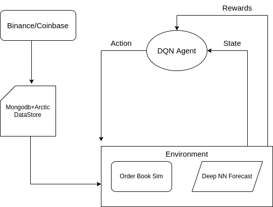

# HFT market making in pytorch and gym

## Agent

Environment State Space is consists of eight indicators: 
1) LOB levels rendered as stationary prices;
2) cumulative notional value at each price level; 
3) imbalances for cumulative notionals;
4) order inflow imbalances at LOB levels; 
5) the spread between the best bid and ask prices; 
6) custom price momentum indicator;
7) custom trade flow imbalance indicator; and 
8) environmental reward signal.
9) forecasted volatility.

    
### Distance to midpoint
Distance $\xi$ is the difference from price $p$ at LOB level $i$ from midpoint $m$ at time $t$. 
$$ \xi_{t,i}^{bid,ask} = \frac{p_{t,i}^{bid, ask}} {m_t} - 1 $$

### Cumulative Notional Value at Price Level
Cumulative sum $\chi$ is the sum of the product of price $p$ and quantity $q$ at LOB level $i$ at the time $t$ for both $bid$ and $ask$ sides. The LOB's first 15 price levels are extracted from $bid$ and $ask$ sides of the LOB, thus creating 30 values for this features.
$$ \chi_{t,i}^{bid, ask} = \sum_{i=0}^{I-1} p_{bid, ask}^{t,i} \times q_{bid, ask}^{t,i}$$

### Notional Imbalances
The order imbalances $\iota$ are represented by notional value and normalized to the scale [−1, 1]. Since there are 15 price levels included, there are 15 values for this feature.
$$ \iota_{t,i} = \frac{\chi_{t,i}^{ask,q} - \chi_{t,i}^{bid, q}}{\chi_{t,i}^{ask,q} + \chi_{t,i}^{bid,q}} $$

# Tools to use
1. pytorch
2. cryptofeed
3. influxdb
4. DQN
5. Trading Gym
6. 